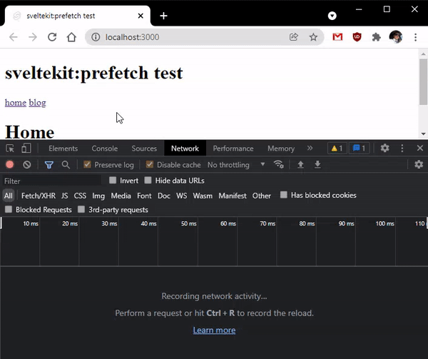

# sveltekit:prefetch bug

Reproducing bug with `sveltekit:prefetch` not working in a fresh svelte-kit install.

This repo was initialized with:
`npm init svelte@next test`

- type: skeleton app

- TypeScript: yes

- ESLint: yes

- Prettier: yes
